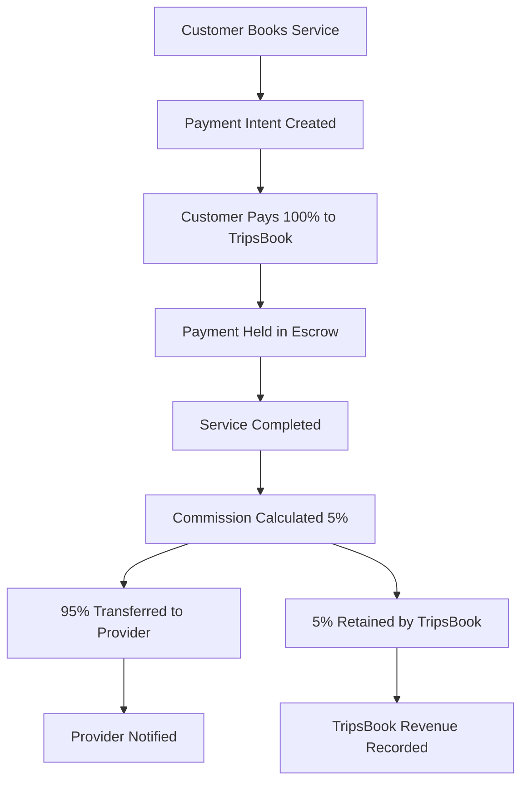

# TripsBook Commission & Payment System Design

## 5% Commission Model Architecture

### System Overview
TripsBook operates on a **5% commission model** where:
- Customers pay **100%** of service fees to TripsBook
- TripsBook holds payment in **escrow** until service completion
- After successful completion: **95%** goes to provider, **5%** to TripsBook
- Weekly payout system for providers

## Payment Flow Architecture

### 1. Payment Processing Flow


### 2. Database Schema for Payments
```go
// tripsbook/models/payments.go
type Payment struct {
    Model
    BookingID        uint      `json:"booking_id"`
    CustomerID       uint      `json:"customer_id"`
    ProviderID       uint      `json:"provider_id"`
    
    // Payment details
    PaymentIntentID  string    `json:"payment_intent_id" gorm:"unique"`
    Amount           float64   `json:"amount"`
    Currency         string    `json:"currency" gorm:"default:'NGN'"`
    Status           string    `json:"status" gorm:"default:'pending'"` // pending, processing, completed, failed, refunded
    
    // Commission details
    CommissionRate   float64   `json:"commission_rate" gorm:"default:0.05"`
    CommissionAmount float64   `json:"commission_amount"`
    ProviderAmount   float64   `json:"provider_amount"`
    
    // Timestamps
    PaidAt           *time.Time `json:"paid_at"`
    ProcessedAt      *time.Time `json:"processed_at"`
    RefundedAt       *time.Time `json:"refunded_at"`
    
    // Stripe details
    StripeChargeID   string    `json:"stripe_charge_id"`
    TransferID       string    `json:"transfer_id"`
    
    Booking          Booking         `json:"booking"`
    Customer         User            `json:"customer"`
    Provider         ServiceProvider `json:"provider"`
    Commission       *Commission     `json:"commission,omitempty"`
}

type Commission struct {
    Model
    PaymentID        uint      `json:"payment_id"`
    BookingID        uint      `json:"booking_id"`
    ProviderID       uint      `json:"provider_id"`
    
    // Commission details
    BaseAmount       float64   `json:"base_amount"`
    CommissionRate   float64   `json:"commission_rate"`
    CommissionAmount float64   `json:"commission_amount"`
    
    // Status tracking
    Status           string    `json:"status" gorm:"default:'pending'"` // pending, collected, paid_to_provider, written_off
    CollectedAt      *time.Time `json:"collected_at"`
    PaidToProviderAt *time.Time `json:"paid_to_provider_at"`
    
    // Financial tracking
    StripeTransferID string    `json:"stripe_transfer_id"`
    TransactionRef   string    `json:"transaction_ref"`
    
    Payment          Payment         `json:"payment"`
    Booking          Booking         `json:"booking"`
    Provider         ServiceProvider `json:"provider"`
}

type ProviderPayout struct {
    Model
    ProviderID       uint      `json:"provider_id"`
    
    // Payout details
    TotalAmount      float64   `json:"total_amount"`
    CommissionAmount float64   `json:"commission_amount"`
    NetAmount        float64   `json:"net_amount"`
    Currency         string    `json:"currency" gorm:"default:'NGN'"`
    
    // Status tracking
    Status           string    `json:"status" gorm:"default:'pending'"` // pending, processing, completed, failed
    PayoutDate       time.Time `json:"payout_date"`
    ProcessedAt      *time.Time `json:"processed_at"`
    
    // Transfer details
    StripeTransferID string    `json:"stripe_transfer_id"`
    BankAccount      string    `json:"bank_account"`
    AccountName      string    `json:"account_name"`
    BankName         string    `json:"bank_name"`
    
    Provider         ServiceProvider `json:"provider"`
    Payments         []Payment        `json:"payments"`
}
```

### 3. Payment Service Implementation
```go
// tripsbook/services/payment_service.go
type PaymentService struct {
    db             *gorm.DB
    stripeService  *StripeService
    commissionService *CommissionService
    notificationService *NotificationService
}

func (s *PaymentService) CreatePaymentIntent(booking *Booking) (*PaymentIntent, error) {
    // Calculate amounts
    commissionAmount := booking.TotalAmount * 0.05 // 5% commission
    providerAmount := booking.TotalAmount - commissionAmount
    
    // Create payment intent with Stripe
    stripeIntent, err := s.stripeService.CreatePaymentIntent(booking.TotalAmount, "NGN")
    if err != nil {
        return nil, fmt.Errorf("failed to create payment intent: %w", err)
    }
    
    // Create payment record
    payment := &Payment{
        BookingID:        booking.ID,
        CustomerID:       booking.CustomerID,
        ProviderID:       booking.ProviderID,
        PaymentIntentID:  stripeIntent.ID,
        Amount:           booking.TotalAmount,
        CommissionRate:   0.05,
        CommissionAmount: commissionAmount,
        ProviderAmount:   providerAmount,
        Status:          "pending",
    }
    
    if err := s.db.Create(payment).Error; err != nil {
        return nil, fmt.Errorf("failed to create payment record: %w", err)
    }
    
    return stripeIntent, nil
}

func (s *PaymentService) ConfirmPayment(paymentIntentID string) error {
    // Find payment record
    payment := &Payment{}
    if err := s.db.Where("payment_intent_id = ?", paymentIntentID).First(payment).Error; err != nil {
        return fmt.Errorf("payment not found: %w", err)
    }
    
    // Verify with Stripe
    stripePayment, err := s.stripeService.ConfirmPayment(paymentIntentID)
    if err != nil {
        return fmt.Errorf("payment confirmation failed: %w", err)
    }
    
    // Update payment record
    payment.Status = "completed"
    payment.StripeChargeID = stripePayment.ChargeID
    now := time.Now()
    payment.PaidAt = &now
    
    if err := s.db.Save(payment).Error; err != nil {
        return fmt.Errorf("failed to update payment: %w", err)
    }
    
    // Create commission record
    commission := &Commission{
        PaymentID:        payment.ID,
        BookingID:        payment.BookingID,
        ProviderID:       payment.ProviderID,
        BaseAmount:       payment.Amount,
        CommissionRate:   payment.CommissionRate,
        CommissionAmount: payment.CommissionAmount,
        Status:          "pending",
    }
    
    if err := s.db.Create(commission).Error; err != nil {
        return fmt.Errorf("failed to create commission: %w", err)
    }
    
    // Notify provider and customer
    go s.notifyPaymentConfirmed(payment)
    
    return nil
}

func (s *PaymentService) ProcessPayout(providerID uint) error {
    // Calculate provider's earnings for the week
    weekStart := time.Now().AddDate(0, 0, -7).Truncate(24 * time.Hour)
    weekEnd := time.Now().Truncate(24 * time.Hour)
    
    var payments []Payment
    err := s.db.Where("provider_id = ? AND status = ? AND paid_at BETWEEN ? AND ?", 
        providerID, "completed", weekStart, weekEnd).
        Find(&payments).Error
    if err != nil {
        return fmt.Errorf("failed to fetch payments: %w", err)
    }
    
    if len(payments) == 0 {
        return fmt.Errorf("no payments to process")
    }
    
    // Calculate totals
    var totalAmount, totalCommission float64
    for _, payment := range payments {
        totalAmount += payment.Amount
        totalCommission += payment.CommissionAmount
    }
    
    netAmount := totalAmount - totalCommission
    
    // Get provider bank details
    provider := &ServiceProvider{}
    if err := s.db.Preload("User").First(provider, providerID).Error; err != nil {
        return fmt.Errorf("provider not found: %w", err)
    }
    
    // Create Stripe transfer
    transfer, err := s.stripeService.CreateTransfer(
        netAmount,
        "NGN",
        provider.StripeAccountID,
    )
    if err != nil {
        return fmt.Errorf("failed to create transfer: %w", err)
    }
    
    // Create payout record
    payout := &ProviderPayout{
        ProviderID:       providerID,
        TotalAmount:      totalAmount,
        CommissionAmount: totalCommission,
        NetAmount:        netAmount,
        Status:          "processing",
        PayoutDate:      time.Now(),
        StripeTransferID: transfer.ID,
    }
    
    if err := s.db.Create(payout).Error; err != nil {
        return fmt.Errorf("failed to create payout: %w", err)
    }
    
    // Update commission records
    for _, payment := range payments {
        commission := &Commission{}
        if err := s.db.Where("payment_id = ?", payment.ID).First(commission).Error; err == nil {
            commission.Status = "paid_to_provider"
            commission.PaidToProviderAt = &time.Time{}
            *commission.PaidToProviderAt = time.Now()
            commission.StripeTransferID = transfer.ID
            s.db.Save(commission)
        }
    }
    
    // Notify provider
    go s.notifyPayoutProcessed(provider, payout)
    
    return nil
}
```

### 4. Commission Service
```go
// tripsbook/services/commission_service.go
type CommissionService struct {
    db            *gorm.DB
    stripeService *StripeService
}

func (s *CommissionService) CalculateCommission(booking *Booking) *Commission {
    commissionRate := 0.05 // 5%
    commissionAmount := booking.TotalAmount * commissionRate
    
    return &Commission{
        BookingID:        booking.ID,
        ProviderID:       booking.ProviderID,
        BaseAmount:       booking.TotalAmount,
        CommissionRate:   commissionRate,
        CommissionAmount: commissionAmount,
        Status:          "pending",
    }
}

func (s *CommissionService) GetCommissionReport(startDate, endDate time.Time) (*CommissionReport, error) {
    var report CommissionReport
    
    // Total commission collected
    err := s.db.Model(&Commission{}).
        Where("status = ? AND collected_at BETWEEN ? AND ?", 
            "collected", startDate, endDate).
        Select("SUM(commission_amount) as total_collected, COUNT(*) as total_transactions").
        Scan(&report).Error
    if err != nil {
        return nil, err
    }
    
    // Commission by category
    var categoryCommissions []CategoryCommission
    err = s.db.Raw(`
        SELECT 
            sc.name as category_name,
            SUM(c.commission_amount) as total_commission,
            COUNT(*) as transaction_count
        FROM commissions c
        JOIN bookings b ON c.booking_id = b.id
        JOIN service_providers sp ON c.provider_id = sp.id
        JOIN service_sub_categories ssc ON sp.sub_category_id = ssc.id
        JOIN service_categories sc ON ssc.category_id = sc.id
        WHERE c.status = 'collected' AND c.collected_at BETWEEN ? AND ?
        GROUP BY sc.name
        ORDER BY total_commission DESC
    `, startDate, endDate).Scan(&categoryCommissions).Error
    if err != nil {
        return nil, err
    }
    
    report.ByCategory = categoryCommissions
    
    return &report, nil
}

type CommissionReport struct {
    TotalCollected    float64            `json:"total_collected"`
    TotalTransactions int64              `json:"total_transactions"`
    ByCategory        []CategoryCommission `json:"by_category"`
    StartDate         time.Time          `json:"start_date"`
    EndDate           time.Time          `json:"end_date"`
}

type CategoryCommission struct {
    CategoryName     string  `json:"category_name"`
    TotalCommission  float64 `json:"total_commission"`
    TransactionCount int64   `json:"transaction_count"`
}
```

### 5. Stripe Integration Service
```go
// tripsbook/services/stripe_service.go
type StripeService struct {
    client *stripe.Client
}

func NewStripeService(secretKey string) *StripeService {
    stripe.Key = secretKey
    return &StripeService{
        client: stripe.NewClient(secretKey),
    }
}

func (s *StripeService) CreatePaymentIntent(amount float64, currency string) (*stripe.PaymentIntent, error) {
    amountInCents := int64(amount * 100) // Convert to cents
    
    params := &stripe.PaymentIntentParams{
        Amount:   stripe.Int64(amountInCents),
        Currency: stripe.String(currency),
        PaymentMethodTypes: stripe.StringSlice([]string{"card"}),
        Metadata: map[string]string{
            "platform": "tripsbook",
        },
    }
    
    return paymentintents.New(params)
}

func (s *StripeService) ConfirmPayment(paymentIntentID string) (*stripe.PaymentIntent, error) {
    return paymentintents.Get(paymentIntentID, nil)
}

func (s *StripeService) CreateTransfer(amount float64, currency string, destinationAccount string) (*stripe.Transfer, error) {
    amountInCents := int64(amount * 100)
    
    params := &stripe.TransferParams{
        Amount:      stripe.Int64(amountInCents),
        Currency:    stripe.String(currency),
        Destination: stripe.String(destinationAccount),
        Metadata: map[string]string{
            "platform": "tripsbook",
            "type":     "provider_payout",
        },
    }
    
    return transfers.New(params)
}

func (s *StripeService) CreateConnectAccount(email string, country string) (*stripe.Account, error) {
    params := &stripe.AccountParams{
        Type:      stripe.String("express"),
        Country:   stripe.String(country),
        Email:     stripe.String(email),
        Capabilities: &stripe.AccountCapabilitiesParams{
            CardPayments: &stripe.AccountCapabilitiesCardPaymentsParams{
                Requested: stripe.Bool(true),
            },
            Transfers: &stripe.AccountCapabilitiesTransfersParams{
                Requested: stripe.Bool(true),
            },
        },
    }
    
    return accounts.New(params)
}
```

### 6. Provider Onboarding for Payments
```go
// tripsbook/services/provider_payment_setup.go
type ProviderPaymentSetupService struct {
    db            *gorm.DB
    stripeService *StripeService
}

func (s *ProviderPaymentSetupService) SetupProviderPayments(providerID uint) error {
    provider := &ServiceProvider{}
    if err := s.db.Preload("User").First(provider, providerID).Error; err != nil {
        return fmt.Errorf("provider not found: %w", err)
    }
    
    // Create Stripe Connect account
    stripeAccount, err := s.stripeService.CreateConnectAccount(
        provider.User.Email,
        "NG", // Nigeria
    )
    if err != nil {
        return fmt.Errorf("failed to create Stripe account: %w", err)
    }
    
    // Update provider record
    provider.StripeAccountID = stripeAccount.ID
    provider.PaymentSetupComplete = false
    
    if err := s.db.Save(provider).Error; err != nil {
        return fmt.Errorf("failed to update provider: %w", err)
    }
    
    // Generate onboarding link
    onboardingLink, err := s.stripeService.CreateAccountLink(stripeAccount.ID)
    if err != nil {
        return fmt.Errorf("failed to create onboarding link: %w", err)
    }
    
    // Send onboarding email
    go s.sendPaymentSetupEmail(provider.User.Email, onboardingLink.URL)
    
    return nil
}

func (s *StripeService) CreateAccountLink(accountID string) (*stripe.AccountLink, error) {
    params := &stripe.AccountLinkParams{
        Account:    stripe.String(accountID),
        RefreshURL: stripe.String("https://tripsbook.com/provider/payment-setup/refresh"),
        ReturnURL:  stripe.String("https://tripsbook.com/provider/payment-setup/complete"),
        Type:       stripe.String("account_onboarding"),
    }
    
    return accountlinks.New(params)
}
```

### 7. Automated Payout System
```go
// tripsbook/services/payout_scheduler.go
type PayoutScheduler struct {
    db             *gorm.DB
    paymentService *PaymentService
}

func (s *PayoutScheduler) ScheduleWeeklyPayouts() error {
    // Get all active providers
    var providers []ServiceProvider
    if err := s.db.Where("is_verified = ? AND is_available = ?", true, true).Find(&providers).Error; err != nil {
        return fmt.Errorf("failed to get providers: %w", err)
    }
    
    // Process payouts for each provider
    for _, provider := range providers {
        go func(p ServiceProvider) {
            if err := s.paymentService.ProcessPayout(p.ID); err != nil {
                log.Printf("Failed to process payout for provider %d: %v", p.ID, err)
            }
        }(provider)
    }
    
    return nil
}

func (s *PayoutScheduler) RunDaily() {
    // Check if today is payout day (e.g., Friday)
    if time.Now().Weekday() == time.Friday {
        log.Println("Starting weekly payout processing")
        if err := s.ScheduleWeeklyPayouts(); err != nil {
            log.Printf("Payout processing failed: %v", err)
        } else {
            log.Println("Weekly payout processing completed")
        }
    }
}
```

### 8. Payment Analytics & Reporting
```go
// tripsbook/services/payment_analytics.go
type PaymentAnalytics struct {
    db *gorm.DB
}

func (s *PaymentAnalytics) GetPaymentAnalytics(startDate, endDate time.Time) (*PaymentAnalyticsReport, error) {
    var report PaymentAnalyticsReport
    
    // Total payment volume
    err := s.db.Model(&Payment{}).
        Where("status = ? AND paid_at BETWEEN ? AND ?", "completed", startDate, endDate).
        Select("SUM(amount) as total_volume, COUNT(*) as total_transactions, AVG(amount) as average_transaction").
        Scan(&report).Error
    if err != nil {
        return nil, err
    }
    
    // Commission revenue
    err = s.db.Model(&Commission{}).
        Where("status = ? AND collected_at BETWEEN ? AND ?", "collected", startDate, endDate).
        Select("SUM(commission_amount) as total_commission").
        Scan(&report.TotalCommission).Error
    if err != nil {
        return nil, err
    }
    
    // Daily breakdown
    var dailyStats []DailyPaymentStats
    err = s.db.Raw(`
        SELECT 
            DATE(paid_at) as date,
            SUM(amount) as volume,
            COUNT(*) as transactions,
            SUM(commission_amount) as commission
        FROM payments
        WHERE status = 'completed' AND paid_at BETWEEN ? AND ?
        GROUP BY DATE(paid_at)
        ORDER BY date DESC
    `, startDate, endDate).Scan(&dailyStats).Error
    if err != nil {
        return nil, err
    }
    
    report.DailyStats = dailyStats
    
    return &report, nil
}

type PaymentAnalyticsReport struct {
    TotalVolume        float64           `json:"total_volume"`
    TotalTransactions  int64             `json:"total_transactions"`
    AverageTransaction float64           `json:"average_transaction"`
    TotalCommission    float64           `json:"total_commission"`
    DailyStats         []DailyPaymentStats `json:"daily_stats"`
    StartDate          time.Time         `json:"start_date"`
    EndDate            time.Time         `json:"end_date"`
}

type DailyPaymentStats struct {
    Date        string  `json:"date"`
    Volume      float64 `json:"volume"`
    Transactions int64   `json:"transactions"`
    Commission  float64 `json:"commission"`
}
```

### 9. Payment Webhooks
```go
// tripsbook/handlers/webhooks.go
type WebhookHandler struct {
    paymentService *PaymentService
    db             *gorm.DB
}

func (h *WebhookHandler) HandleStripeWebhook(c *gin.Context) {
    body, err := io.ReadAll(c.Request.Body)
    if err != nil {
        c.JSON(400, ErrorResponse("Failed to read webhook body", err))
        return
    }
    
    // Verify webhook signature
    event, err := stripe.ConstructEvent(body, c.GetHeader("Stripe-Signature"), os.Getenv("STRIPE_WEBHOOK_SECRET"))
    if err != nil {
        c.JSON(400, ErrorResponse("Invalid webhook signature", err))
        return
    }
    
    switch event.Type {
    case "payment_intent.succeeded":
        h.handlePaymentSucceeded(event.Data.Object)
    case "transfer.completed":
        h.handleTransferCompleted(event.Data.Object)
    case "account.updated":
        h.handleAccountUpdated(event.Data.Object)
    default:
        log.Printf("Unhandled webhook event type: %s", event.Type)
    }
    
    c.JSON(200, gin.H{"status": "received"})
}

func (h *WebhookHandler) handlePaymentSucceeded(obj stripe.EventObject) {
    paymentIntent, ok := obj.(*stripe.PaymentIntent)
    if !ok {
        log.Printf("Invalid payment intent object")
        return
    }
    
    if err := h.paymentService.ConfirmPayment(paymentIntent.ID); err != nil {
        log.Printf("Failed to confirm payment %s: %v", paymentIntent.ID, err)
    }
}

func (h *WebhookHandler) handleTransferCompleted(obj stripe.EventObject) {
    transfer, ok := obj.(*stripe.Transfer)
    if !ok {
        log.Printf("Invalid transfer object")
        return
    }
    
    // Update payout record
    payout := &ProviderPayout{}
    if err := h.db.Where("stripe_transfer_id = ?", transfer.ID).First(payout).Error; err == nil {
        payout.Status = "completed"
        now := time.Now()
        payout.ProcessedAt = &now
        h.db.Save(payout)
    }
}
```

### 10. Error Handling & Edge Cases
```go
// tripsbook/services/payment_error_handling.go
type PaymentErrorHandler struct {
    db             *gorm.DB
    notificationService *NotificationService
}

func (s *PaymentErrorHandler) HandleFailedPayment(paymentID uint, reason string) error {
    payment := &Payment{}
    if err := s.db.First(payment, paymentID).Error; err != nil {
        return fmt.Errorf("payment not found: %w", err)
    }
    
    // Update payment status
    payment.Status = "failed"
    if err := s.db.Save(payment).Error; err != nil {
        return fmt.Errorf("failed to update payment: %w", err)
    }
    
    // Update booking status
    booking := &Booking{}
    if err := s.db.First(booking, payment.BookingID).Error; err == nil {
        booking.PaymentStatus = "failed"
        s.db.Save(booking)
    }
    
    // Notify customer and provider
    go s.notifyPaymentFailed(payment, reason)
    
    return nil
}

func (s *PaymentErrorHandler) HandleRefund(paymentID uint, reason string) error {
    payment := &Payment{}
    if err := s.db.First(payment, paymentID).Error; err != nil {
        return fmt.Errorf("payment not found: %w", err)
    }
    
    // Process refund with Stripe
    if payment.StripeChargeID != "" {
        err := s.processStripeRefund(payment.StripeChargeID, reason)
        if err != nil {
            return fmt.Errorf("failed to process refund: %w", err)
        }
    }
    
    // Update payment status
    payment.Status = "refunded"
    now := time.Now()
    payment.RefundedAt = &now
    s.db.Save(payment)
    
    // Update commission
    commission := &Commission{}
    if err := s.db.Where("payment_id = ?", payment.ID).First(commission).Error; err == nil {
        commission.Status = "refunded"
        s.db.Save(commission)
    }
    
    return nil
}
```

## Implementation Checklist

### Phase 1: Core Payment Infrastructure
- [ ] Set up Stripe account and API keys
- [ ] Implement payment intent creation
- [ ] Create payment confirmation flow
- [ ] Set up database schema for payments and commissions
- [ ] Implement basic payment processing

### Phase 2: Commission System
- [ ] Implement commission calculation (5%)
- [ ] Create commission tracking
- [ ] Set up commission collection
- [ ] Implement commission reporting
- [ ] Create commission analytics

### Phase 3: Provider Payouts
- [ ] Set up Stripe Connect for providers
- [ ] Implement provider onboarding for payments
- [ ] Create automated weekly payout system
- [ ] Implement payout tracking and reporting
- [ ] Set up payout notifications

### Phase 4: Webhooks & Error Handling
- [ ] Implement Stripe webhook handlers
- [ ] Set up payment failure handling
- [ ] Create refund processing
- [ ] Implement error notifications
- [ ] Set up payment dispute handling

### Phase 5: Analytics & Reporting
- [ ] Create payment analytics dashboard
- [ ] Implement commission reporting
- [ ] Set up provider earnings reports
- [ ] Create financial reconciliation
- [ ] Implement revenue forecasting

## Security & Compliance

### 1. PCI Compliance
- Use Stripe Elements for secure card collection
- Never store raw card data
- Implement proper tokenization
- Regular security audits

### 2. Fraud Prevention
- Implement transaction monitoring
- Set up velocity checks
- Use Stripe Radar for fraud detection
- Implement suspicious activity alerts

### 3. Regulatory Compliance
- KYC/AML verification for providers
- Transaction reporting requirements
- Tax compliance for payouts
- Data protection compliance

## Success Metrics

### Financial KPIs
- **Payment Success Rate**: >95%
- **Commission Collection**: 100% of completed bookings
- **Payout Processing Time**: <24 hours
- **Refund Processing Time**: <48 hours

### Operational KPIs
- **Payment Processing Time**: <2 seconds
- **Payout Accuracy**: 99.9%
- **Dispute Resolution Time**: <72 hours
- **Customer Satisfaction**: >4.5/5

This comprehensive payment and commission system ensures:
1. **Secure payment processing** through Stripe
2. **Automated commission collection** at 5%
3. **Reliable provider payouts** on weekly schedule
4. **Complete financial tracking** and reporting
5. **Robust error handling** and dispute resolution
6. **Scalable architecture** for growth
